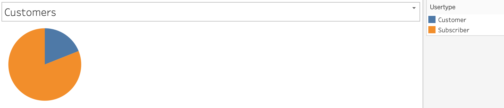
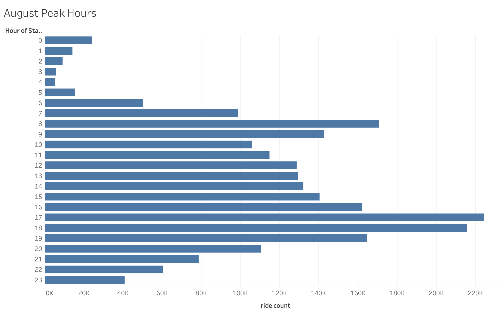
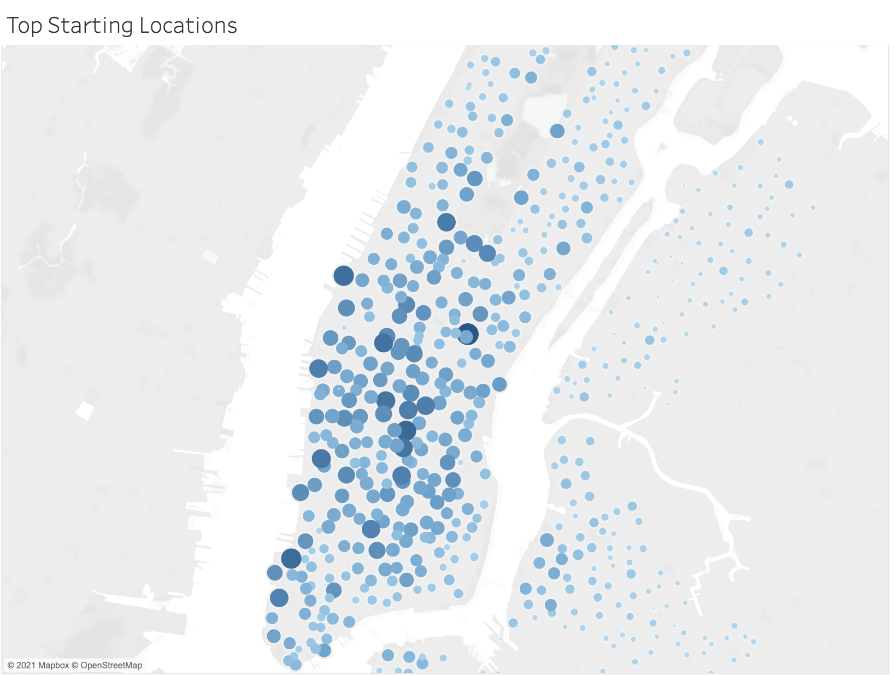
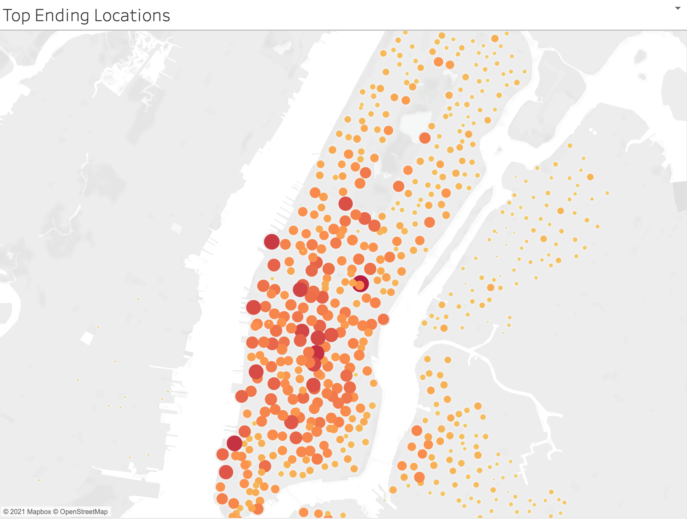
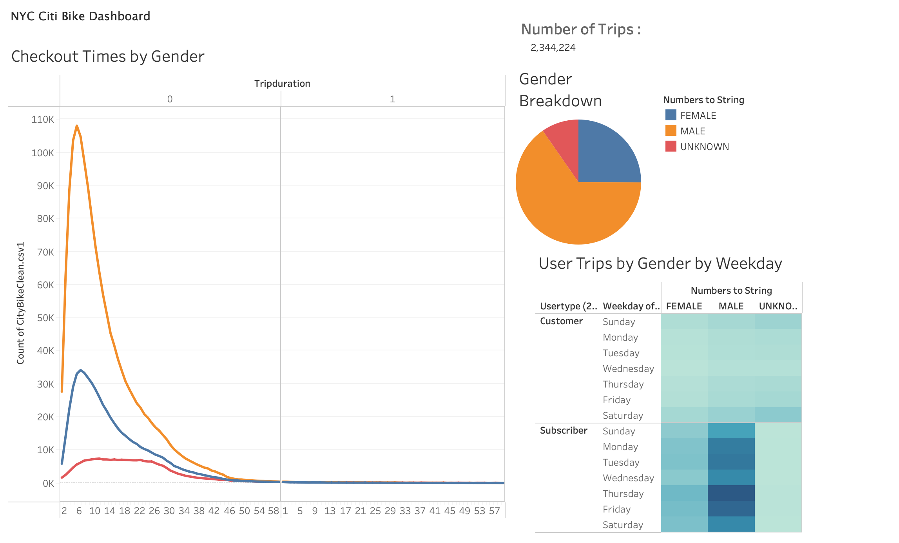

# bike-sharing

## Resources
* Python 3.9.0, 
* Jupyter notebook 6.0.3,
* Pandas,
* Tableau.

## Overview of Project

Analyze CityBike Rideshare data to uncover trends in customer behavior. then visualize them using Tableau Public to help implement the same bikeshare business module in Des Moines.
You can view the Tableau Public workbook [here](https://public.tableau.com/profile/mouad.lachhab#!/vizhome/Citybikestory_16219086459090/BikeShareStory?publish=yes).

## Analysis and Challenges

### Challenges:

- The cities are very different; it would be hard to apply trends from a big city like NY to a smaller one like Des Moines.
- the dataset is limited made up of 2,344,224 rides, all during the same month of august.
- we don’t have any information about Des Moines or its infrastructure.
- we lack demographic data about Des Moines.

### Analysis:

 - Preparing the data: 

Before doing any visualizations, we used Python and the Pandas library to clean the data. we did the changes in a Jupyter Notebook then exported the data to a new CSV file that was used to extract the data used to create the Vizs. -the ipynb file has been added to the repository-

#### Data Visualizations:

- these are some of visualizations created:

Citybike customers break into one-time customers and the service subscribers, this is how they break down.

- the next Viz shows the Peak times during the month of august.

- The next visualization shows where the top trip starting stations are located.

  we can see that most of them are around the same few blocks 

- Next we see the top trip ending locations.

  we can see that most of them also cluster around the same area.

- Next is a dashboard that shows how different metrics breakdown by gender.

